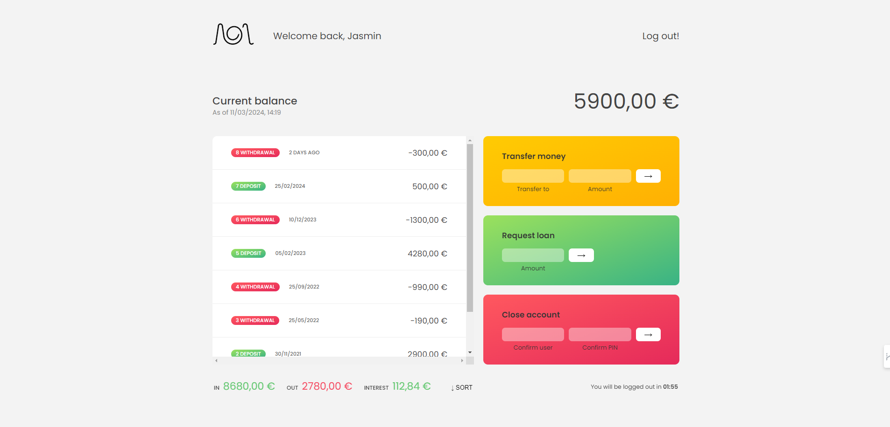
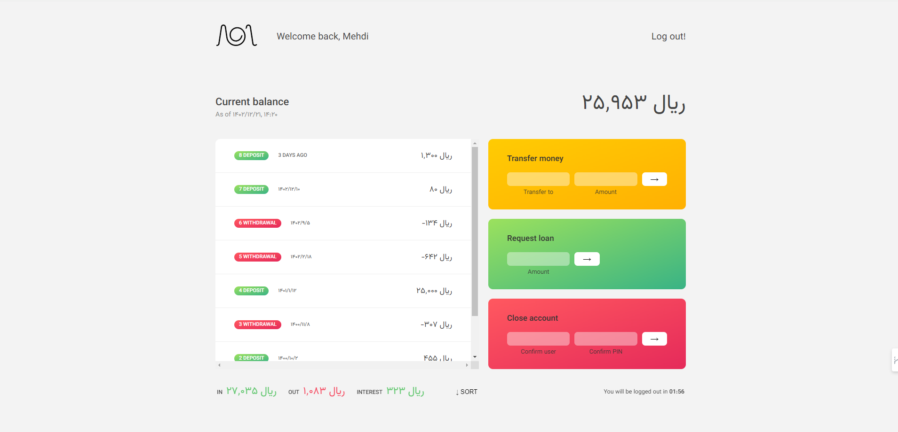

# Banchist:

Banchist è un'esperienza bancaria virtuale. Si tratta di un progetto ideato da Jonas Schmedtmann per praticare la manipolazione del DOM e l'interazione utente.
Ho rifatto tutta la parte logica del progetto per dimostrare le mie competenze su JavaScript. Ho sviluppato l'idea iniziale, aggiungendo un form di accesso. Ho modificato anche alcuni aspetti di HTML e di CSS.

<https://banchist.netlify.app/>

# Descrizione:

Il progetto prevede tre utenti distinti. La pagina viene personalizzata in base alla località dell’utente che accede. Ad esempio, il primo utente con locale 'fa-IR' e le credenziali user: mk e pass:1111, visualizza la pagina in persiano, mentre il secondo, per esempio: con locale 'en-US', vedrà l'intera pagina in inglese.

# Funzionalità:

1. Accesso (Login)
2. Trasferimento del denaro ad un altro conto
3. Ottenere prestiti
4. Chiudere (eliminare) l'account

# Le credenziali:

    Primo utente:
    username: mk
    Password: 1111

    Secondo utente:
    username: tw
    Password: 2222

    Terzo utente:
    username: jp
    Password: 1111

# Linguaggi di sviluppo:

HTML, CSS, Vanilla JavaScript

# Rappresentazioni Grafiche:

La pagina iniziale dell'applicazion

La pagina del terzo utente

La pagina del primo utente
